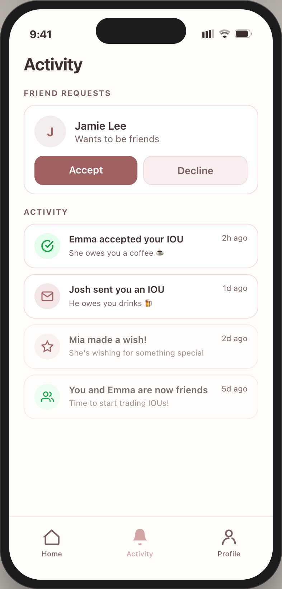
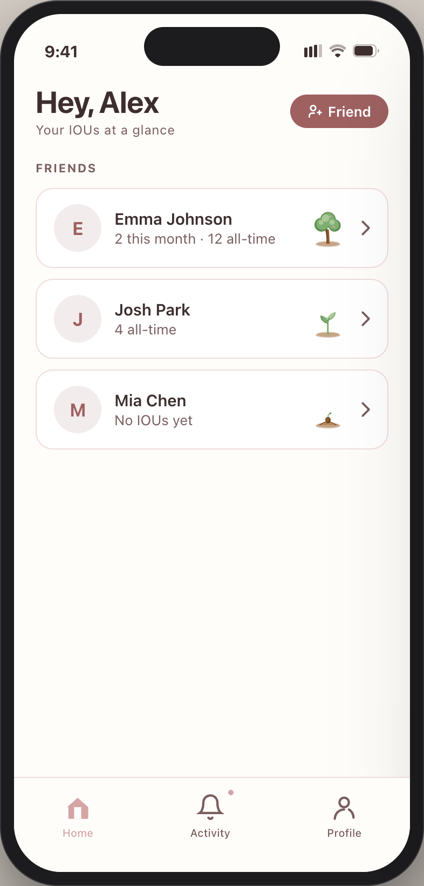
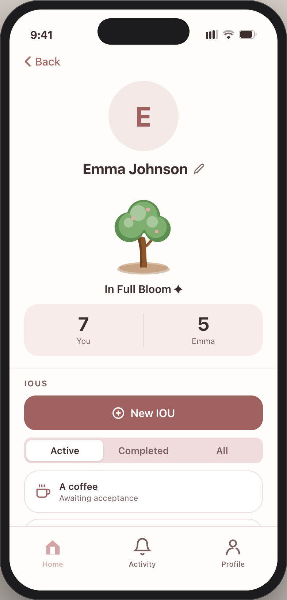
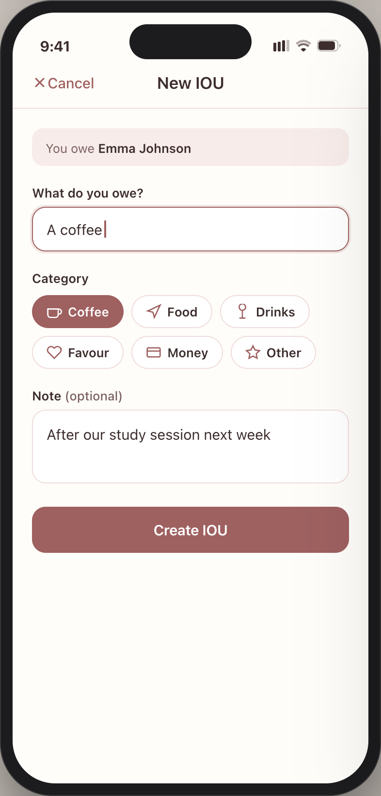
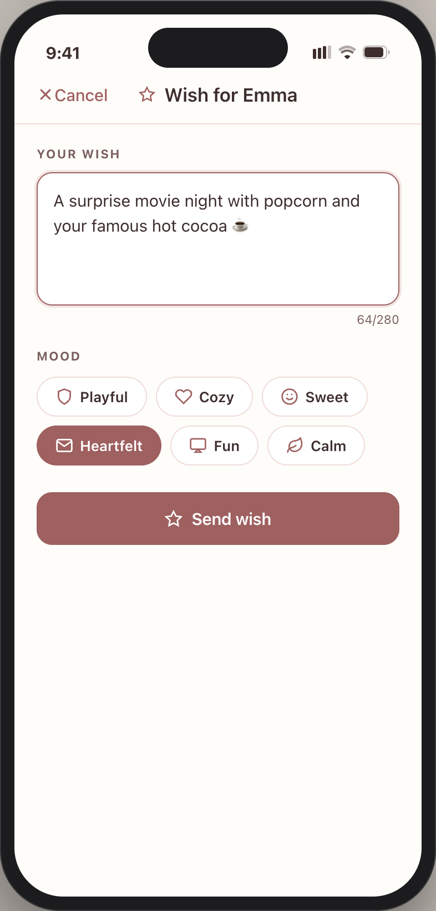

  
  <h1>IOU</h1>
  
<strong>Little things remembered.</strong>

  
  &nbsp;
  

---

## What is IOU?

Friendships run on favours — but we forget them. IOU is a mobile app that lets you and your friends log favours you owe each other, make wishes for things you'd love from someone, and watch your friendship grow into a living tree as you exchange IOUs.

No more awkward "remember when you said you'd…" moments. IOU keeps a shared, honest ledger between friends.

---

## Features

- **IOUs** — Log a favour you owe a friend. Mark it complete when it's done.
- **Wishes** — Tell your friends what you'd love from them. They can grant your wish if they want to.
- **Friendship Tree** — A visual tree that grows with every IOU you exchange. The more you give, the more it flourishes.
- **Push Notifications** — Get notified when a friend sends you an IOU, claims your wish, or marks one complete.
- **Authentication** — Sign in with Google or email. No passwords required.

---

## Screenshots

  
  
  
  
  

---

## Tech Stack

| Layer | Technology |
|---|---|
| Framework | [Expo](https://expo.dev) (React Native) |
| Navigation | [Expo Router](https://expo.github.io/router) |
| Styling | [NativeWind](https://www.nativewind.dev) (Tailwind CSS) |
| Data Fetching | [TanStack Query](https://tanstack.com/query) |
| Backend & Auth | [Supabase](https://supabase.com) (Postgres, Auth, Edge Functions) |
| Push Notifications | [Expo Notifications](https://docs.expo.dev/push-notifications/overview/) |
| Error Monitoring | [Sentry](https://sentry.io) |

---

## How It Works

**IOU Lifecycle**

1. User A creates an IOU — "I owe you" — with a short description.
2. Both users see the pending IOU in their shared feed.
3. The owing party fulfils the favour and marks it complete.
4. The IOU is settled, and the friendship tree grows.

**Wish Lifecycle**

1. User A posts a wish — something they'd love from a friend.
2. A friend sees the wish and chooses to grant it.
3. The wish is marked as granted and both users are notified.

---

## Privacy & Security

IOU is built with privacy in mind. Friendship data, IOUs, and wishes are private — only visible to the two people involved. OAuth tokens are never stored on-device beyond the secure store, and all data is transmitted over HTTPS.

Read the full [Privacy Policy](https://myiou.app/privacy) and [Terms of Service](https://myiou.app/tos).

---

## Links

| | |
|---|---|
| Website | [myiou.app](https://myiou.app) |
| Google Play | [Download on Play Store](https://play.google.com/store/apps/details?id=com.fridayvision.iou) |
| Privacy Policy | [myiou.app/privacy](https://myiou.app/privacy) |
| Terms of Service | [myiou.app/tos](https://myiou.app/tos) |
| User Guide | [myiou.app/guide](https://myiou.app/guide) |
| Support | [support@myiou.app](mailto:support@myiou.app) |

---

  Made with care by <a href="https://github.com/FridayVision">Friday Vision</a>

